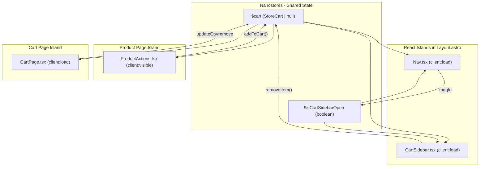

# Cart Functionality Implementation Plan

## Architecture Overview

The main architectural challenge is that Astro uses "islands" -- React components hydrated independently. To share cart state between the header cart icon, the cart sidebar, and the ProductActions component, we will use **nanostores** (`nanostores` + `@nanostores/react`), which is the idiomatic Astro approach for cross-island state management.



### Verified Medusa SDK Cart Methods

From the [official docs](https://docs.medusajs.com/resources/references/js-sdk/store/cart):

- `sdk.store.cart.create({ region_id })` -- Create a cart
- `sdk.store.cart.retrieve(cartId)` -- Retrieve cart by ID
- `sdk.store.cart.createLineItem(cartId, { variant_id, quantity })` -- Add item
- `sdk.store.cart.updateLineItem(cartId, lineItemId, { quantity })` -- Update quantity
- `sdk.store.cart.deleteLineItem(cartId, lineItemId)` -- Remove item

All return `{ cart: StoreCart }`. Types from `@medusajs/types`: `StoreCart`, `StoreCartLineItem`.

---

## Step 1: Install Dependencies

```bash
npm install nanostores @nanostores/react
```

No TanStack Query needed -- nanostores with async actions is sufficient for cart operations. The project already has `@medusajs/js-sdk` and `@medusajs/types`.

---

## Step 2: Cart State Management

Create `**[src/lib/stores/cart.ts](src/lib/stores/cart.ts)**` -- the central cart store shared across all islands.

**State atoms:**

- `$cart` -- `atom<StoreCart | null>(null)` holding the full cart object
- `$isCartSidebarOpen` -- `atom<boolean>(false)` for sidebar visibility
- `$cartItemCount` -- `computed($cart, ...)` deriving total item count

**Actions (async functions):**

- `initCart(regionId: string)` -- On app load: check localStorage for `cart_id`, if exists call `sdk.store.cart.retrieve()`, if not or if error, call `sdk.store.cart.create({ region_id })`. Save cart ID to localStorage.
- `addToCart(variantId: string, quantity: number, regionId: string)` -- If no cart, create one first. Then call `sdk.store.cart.createLineItem()`. Update `$cart` atom. Open sidebar.
- `removeFromCart(lineItemId: string)` -- Call `sdk.store.cart.deleteLineItem()`. Update `$cart`.
- `updateLineItemQuantity(lineItemId: string, quantity: number)` -- Call `sdk.store.cart.updateLineItem()`. Update `$cart`.

**Key details:**

- Cart ID persisted in `localStorage` under key `cart_id`
- Region ID is needed to create a cart -- it will be passed from Astro pages via a prop on the React islands (extracted from URL country code, same as current pattern)
- Prices displayed as-is from Medusa (no dividing by 100)
- Use `convertToLocale()` from existing `[src/lib/utils/money.ts](src/lib/utils/money.ts)` for formatting

---

## Step 3: Header / Nav Component

Create `**[src/modules/layout/components/Nav.tsx](src/modules/layout/components/Nav.tsx)**` -- a React component rendered with `client:load` in Layout.

**Layout (matches the screenshots):**

- Left: "Menu" text/button (placeholder for future mobile menu)
- Center: Store name "MEDUSA STORE" linked to homepage
- Right: "Account" link + Cart icon with item count badge

**Cart icon behavior:**

- Shows item count from `$cartItemCount`
- On hover: highlight/underline the cart text only (no sidebar open)
- On click: toggle `$isCartSidebarOpen`
- `aria-live="polite"` on cart count for screen reader announcements
- `aria-label="Shopping cart with N items"`

**Props:** `countryCode: string` (for links like `/us/store`, `/us/cart`)

---

## Step 4: Cart Sidebar (Drawer)

Create `**[src/modules/layout/components/CartSidebar.tsx](src/modules/layout/components/CartSidebar.tsx)**` -- rendered with `client:v` in Layout, always in DOM.

**Layout:**

- Slides in from the right (CSS transform `translateX(100%)` to `translateX(0)`)
- Width: ~400px on desktop, 90% on mobile
- Semi-transparent backdrop overlay (click to close)
- Smooth transition ~300ms

**Content:**

- **Header**: "Cart" title + close button (X)
- **Items list** (scrollable): For each line item:
  - Product thumbnail (60-80px)
  - Product title
  - Variant info (e.g., "Variant: L") from `item.variant?.title` or `item.variant?.options`
  - Quantity display (e.g., "Quantity: 1")
  - Price (use `item.unit_price` formatted with `convertToLocale`)
  - Remove button (trash icon + "Remove" text)
- **Empty state**: "Your cart is empty" message with "Continue Shopping" link
- **Footer** (sticky):
  - Subtotal row: "Subtotal (excl. taxes)" + formatted amount (`cart.item_subtotal`)
  - "Go to cart" button (full-width, black bg, white text) linking to `/{countryCode}/cart`

**Props:** `countryCode: string`, `regionId: string`

**Accessibility:** `role="dialog"`, `aria-modal="true"`, focus trap, Escape key closes

---

## Step 5: Update ProductActions.tsx

Modify `**[src/modules/products/components/product-details/ProductActions.tsx](src/modules/products/components/product-details/ProductActions.tsx)**`:

- Accept new prop: `regionId: string`
- Import `addToCart` from the cart store
- On "Add to Cart" click: call `addToCart(selectedVariant.id, 1, regionId)` (where `selectedVariant.id` is the matching variant's ID -- we need to add `id` to the variant interface props)
- Show loading state on button during the API call ("Adding..." text)
- Disable button while adding

**Also update the Props interface** to include variant `id` field, since the current interface only has `options`, `manage_inventory`, `allow_backorder`, `inventory_quantity` but is missing the actual variant `id` needed to add to cart.

**Update [productId].astro** to pass `regionId={region.id}` to ProductActions.

---

## Step 6: Update Layout.astro

Modify `**[src/layouts/Layout.astro](src/layouts/Layout.astro)**`:

- Import `Nav` and `CartSidebar` React components
- Render `<Nav client:load countryCode={countryCode} />` before the `<slot />`
- Render `<CartSidebar client:load countryCode={countryCode} regionId={regionId} />` after the `<slot />`
- Extract `countryCode` from `Astro.params` or `Astro.url.pathname`
- Pass `regionId` -- this can be fetched using the existing `getRegion()` helper, or the cart sidebar can call `initCart` lazily when opened

**Note:** Since Layout.astro is used by multiple pages, `countryCode` needs to be extracted from the URL path (first segment after `/`). The `regionId` can be resolved lazily in the cart store based on the country code, or passed from individual pages. The simplest approach: extract countryCode from URL in Layout and let the cart store handle region resolution internally.

Revised approach for region: store `countryCode` in a nanostore atom, and in `initCart()`, resolve the region via the SDK. This avoids threading regionId through Layout.

---

## Step 7: Cart Page

Create `**[src/pages/[countryCode]/cart.astro](src/pages/[countryCode]/cart.astro)**` -- the full cart page route.

- Uses Layout.astro
- Renders a `CartPage.tsx` React component with `client:load`
- Generates static paths using `getRegionParams` (same pattern as store/index.astro)

Create `**[src/modules/cart/components/CartPage.tsx](src/modules/cart/components/CartPage.tsx)**` -- React component for cart page content.

**Two-column layout (matching screenshot 2):**

**Left column (60-70%):**

- "Cart" heading
- Table-style display: Item | Quantity | Price | Total
- Each row: thumbnail, product title + variant, quantity selector (dropdown or +/-), unit price, line total, delete button
- Remove item via trash icon button

**Right column (30-40%, sticky):**

- "Summary" heading
- "Add Promotion Code(s)" link (placeholder, non-functional for now)
- Price breakdown:
  - Subtotal (excl. shipping and taxes): `cart.item_subtotal`
  - Shipping: `cart.shipping_total` or "$0.00"
  - Taxes: `cart.tax_total` or "$0.00"
  - Divider
  - **Total**: `cart.total` (bold)
- "Go to checkout" button (full-width, black bg, white text, non-functional)

**Empty state:** "Your cart is empty" with link back to store

**Props:** `countryCode: string`

---

## File Summary

**New files:**

- `src/lib/stores/cart.ts` -- Cart state management (nanostores)
- `src/modules/layout/components/Nav.tsx` -- Header/navigation bar
- `src/modules/layout/components/CartSidebar.tsx` -- Cart drawer sidebar
- `src/modules/cart/components/CartPage.tsx` -- Full cart page content
- `src/pages/[countryCode]/cart.astro` -- Cart page route

**Modified files:**

- `src/layouts/Layout.astro` -- Add Nav + CartSidebar
- `src/modules/products/components/product-details/ProductActions.tsx` -- Wire up add-to-cart
- `src/pages/[countryCode]/store/[productId].astro` -- Pass regionId to ProductActions

---

## Implementation Notes

- **Reference files to load during implementation:**
  - `reference/components/cart-popup.md` for sidebar patterns
  - `reference/layouts/cart.md` for cart page patterns
  - `reference/connecting-to-backend.md` for state management patterns
  - `reference/medusa.md` for SDK patterns
  - `reference/design.md` before creating any UI component
- **Prices**: Display as-is from Medusa -- never divide by 100
- **Accessibility**: `aria-live="polite"` on cart count, `role="dialog"` on sidebar, keyboard navigation, focus trap
- **Mobile**: 44px minimum touch targets, full-width buttons, responsive sidebar width
- **Animations**: 300ms CSS transitions for sidebar slide-in/out
